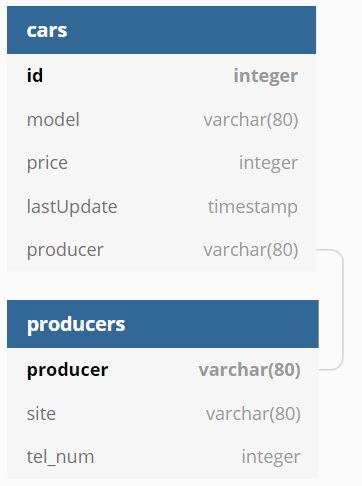

# Лабораторная работа

-----
## Предметная область:
### База данных создержит информацию об автомобилях и их производителях
- Существуют две таблицы:
* в первой информация об автомобиле (ID автомобиля, название модели (допускаем, что названий моделей разных производителей могут совпадать), стоимость, дата последнего обновления кортежа, фирма-проиводитель)
* во второй - информация о производителях (название фирмы, сайт, номер телефона)

* БД в 1НФ, так как все атрибуты атомарны и их нельзя разделить на более простые.

* БД во 2НФ, так как есть первичный ключ и неключевые атрибуты зависят только от целого ключа, а не от подмножества его атрибутов

* БД в 3НФ, так как нет транзитивных зависимостей (зависимости одного неключевого атрибута от других)

-----

